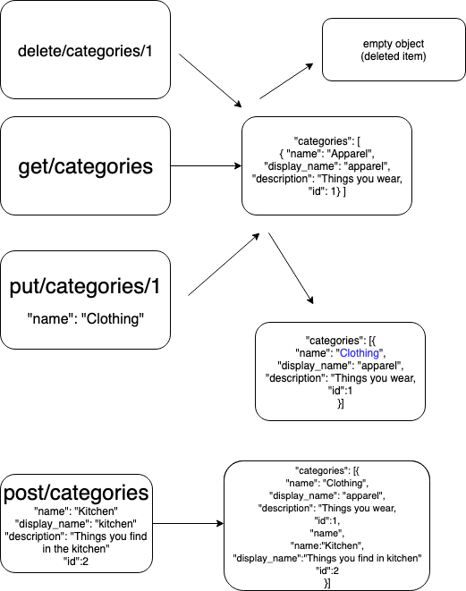
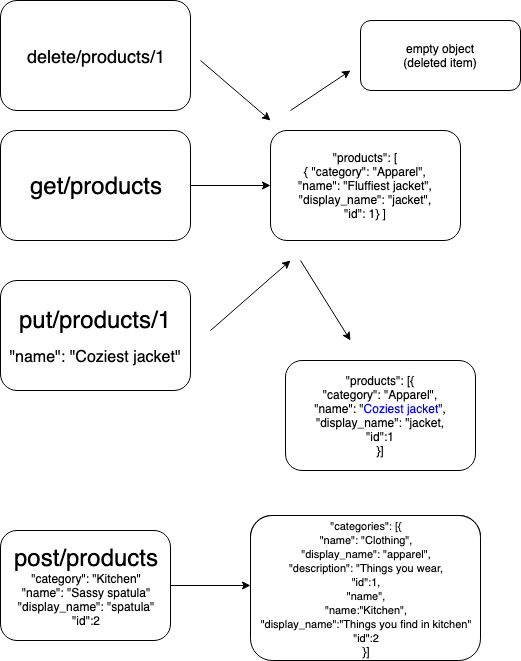

#  LAB

## Simple API

### Author: Bonnie Wang

### Links and Resources

- [submission PR](https://github.com/401-advanced-javascript-bw/lab-06-simpleapi/pull/1)
- [front-end](https://v8k9f.codesandbox.io/)

#### Documentation

- [api docs](https://app.swaggerhub.com/apis/code-fellows/simple-api/0.1) (API servers)

### Setup

- `PORT 3000`

#### Running the app

- `npm i json-server`
- `http [get/post/put/delete] http://localhost:3000/categories`
- `http [get/post/put/delete] http://localhost:3000/products`

#### UML

- 
- 
